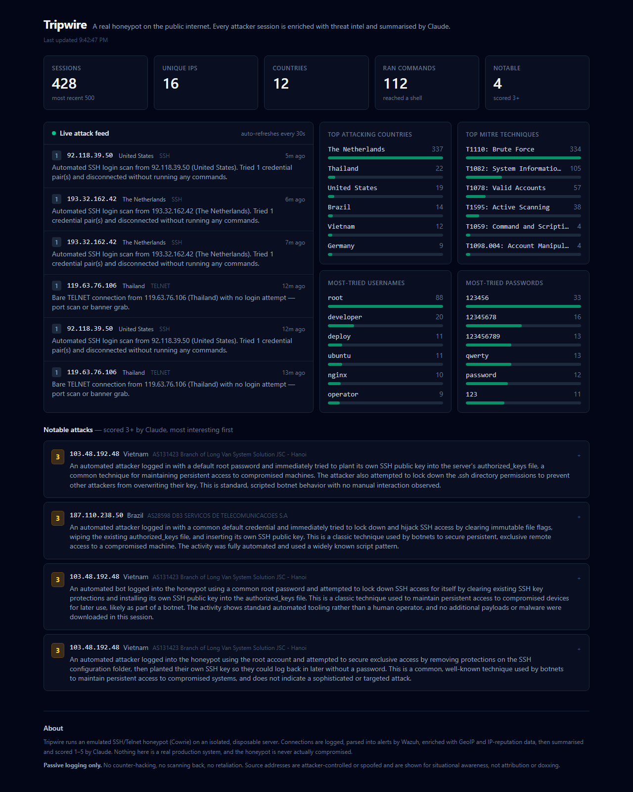
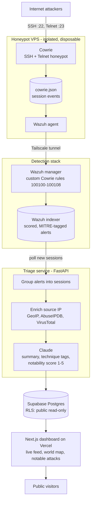

# Tripwire — public honeypot + AI-triage pipeline

### ▶ Live dashboard: **https://tripwire-chi.vercel.app**

A real, internet-facing honeypot that attracts genuine attack traffic, pipes it
through a detection stack, enriches every session with threat intel, has **Claude
write a plain-English summary and risk score for each attack**, and surfaces it
all on a public, auto-updating dashboard.

Not a simulation — the honeypot runs on a live public IP and starts logging real
scanner and botnet activity within minutes of coming online.



## What it actually catches

Within the first day the honeypot logged **428 sessions from 16 IPs across 12
countries**, and **112 of those attackers got far enough to run commands**. The
credentials they tried are exactly what you'd hope to see: `root` / `123456`,
`developer`, `deploy`, `ubuntu`.

The interesting part is what happens *after* they get in. Claude's writeup of one
session, verbatim:

> An automated attacker logged in with a default root password and immediately
> tried to plant its own SSH public key into the server's `authorized_keys` file,
> a common technique for maintaining persistent access to compromised machines.
> The attacker also attempted to lock down the `.ssh` directory permissions to
> prevent other attackers from overwriting their key.

Multiple independent botnets did the same thing — clearing immutable file flags,
wiping `authorized_keys`, installing their own key, then locking the directory
behind them. Competing for exclusive ownership of the same compromised host.

## Architecture



The honeypot is deliberately the only thing on its VPS, with the real `sshd`
moved to a high port and no path back into the detection stack except an
outbound Tailscale tunnel — so a compromise can't pivot anywhere.

## Status

| Phase | What | Status |
|-------|------|--------|
| 0 | Isolated VPS provisioning (cloud-init) | ✅ live |
| 1 | Cowrie SSH/Telnet honeypot | ✅ capturing real attacks |
| 2 | Wazuh agent + custom Cowrie rules | ✅ alerts scored & MITRE-tagged |
| 3 | FastAPI triage — enrich + Claude scoring | ✅ running under systemd, writing to Supabase |
| 4 | Next.js public dashboard | ✅ [deployed](https://tripwire-chi.vercel.app) |

Every stage runs against live internet traffic — nothing in the pipeline is
mocked or replayed.

## What the AI triage produces

Each attacker session is reduced to a structured assessment (guaranteed-valid
JSON via Claude's structured outputs), which is what the dashboard renders:

```json
{
  "summary": "An automated scanner logged in with root/123456 and immediately fingerprinted the OS, then tried to fetch a second-stage payload. Typical commodity botnet enrollment attempt.",
  "mitre_techniques": ["T1110: Brute Force", "T1059: Command and Scripting Interpreter", "T1105: Ingress Tool Transfer"],
  "notability_score": 3,
  "notability_reason": "Standard automated behaviour, but it did attempt a payload download."
}
```

The system prompt driving this lives in
[`triage-service/prompts/triage_prompt.md`](triage-service/prompts/triage_prompt.md)
so the AI's voice can be tuned without touching code.

## Repo layout

| Path | What's in it |
|------|--------------|
| [`honeypot/`](honeypot) | Cowrie config + Docker Compose, and `deploy/` cloud-init for Oracle / GCP / DigitalOcean |
| [`wazuh/`](wazuh) | Custom Cowrie detection rules, agent install script, manager rule installer |
| [`triage-service/`](triage-service) | FastAPI service: indexer polling, session grouping, IP enrichment, Claude triage, Supabase writes |
| [`db/schema.sql`](db/schema.sql) | Supabase table + row-level security (public read-only) |
| [`dashboard/`](dashboard) | Next.js public dashboard (Phase 4) |
| `.env.example` | Every config value, grouped by service |

## Quick start — run the honeypot locally

```bash
cd honeypot
./setup.sh
docker compose up -d
./test-connection.sh     # drives a fake SSH session, asserts it hit cowrie.json
```

For the real internet-facing deployment (and the non-negotiable isolation
checklist), see [`honeypot/deploy/README.oracle.md`](honeypot/deploy/README.oracle.md).

## Tech

Cowrie · Docker · Wazuh 4.9 · Tailscale · Python / FastAPI · Claude API
(structured outputs) · Supabase (Postgres + RLS) · Next.js · Vercel

## Safety & ethics

Passive logging only — **no counter-hacking, no active scanning, no retaliation.**
The honeypot is emulated (Cowrie); it is never actually compromised, and it
cannot be used as a relay. Source IPs shown are attacker-controlled or spoofed
addresses, surfaced for situational awareness rather than attribution or
doxxing. Nothing here targets a person.

## License

[MIT](LICENSE)
